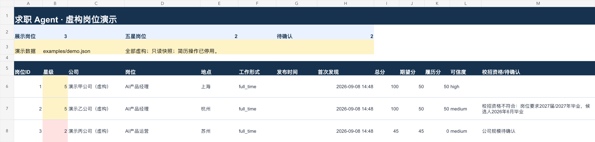
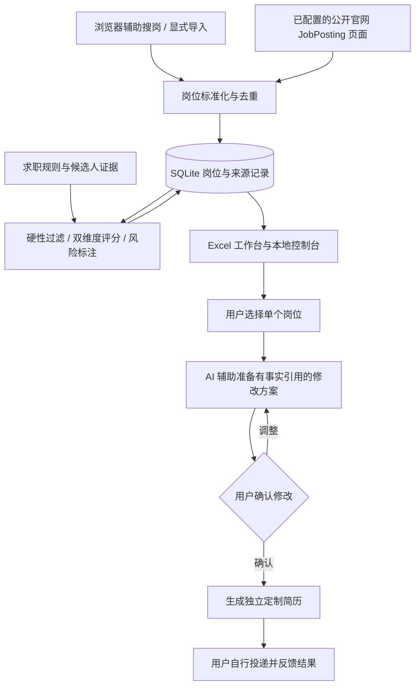

# 求职 Agent · 可解释的岗位筛选与简历定制工作台

从真实求职需求出发，将分散的岗位信息整理为可追溯、可比较的机会清单，并在用户确认后生成基于真实经历的定制简历。

**产品关键词：** 需求定义 · 评分机制 · AI 工作流 · 人工确认 · 真实场景迭代

**技术实现：** Python 3.13+ · FastAPI · SQLite · Excel · python-docx

当前为本地单用户 MVP。作者主导产品需求、评分机制、核心流程和验收要求设计，借助 AI 完成代码实现，并通过实际求职过程持续试用和迭代。

公开版中的候选人背景为虚构示例；毕业年份及经历字段用于测试规则，不代表作者履历。发布分支只保留经过脱敏的当前快照，迭代过程通过评测基线与文档说明，不包含私人开发提交历史。

## 为什么做这个项目

求职过程中的三个重复问题是：岗位分散在不同平台、岗位适配判断缺少一致标准、为不同岗位准备简历容易重复劳动或引入无依据的描述。

工作台将这些问题串成一个流程：先汇总岗位，再解释匹配结果，最后逐份确认简历改写。星级代表内部评估优先级，不代表录用概率；目前尚未测量节省时间或投递转化率。

## 一条命令体验离线演示

按下方本地启动说明安装依赖后运行：

```bash
.venv/bin/job-agent demo
```

命令打印独立输出目录。打开其中的 `README.md` 查看逐项评分与简历修改方案，`results.json` 查看机器可读结果。每次运行创建新的演示 SQLite，不读取个人配置、真实候选人资料、招聘账号或 API Key，不发起网络请求。



上图为实际工作簿的 A1:M8 区域渲染，非 Excel 应用窗口截图。使用现有导出器和虚构 SQLite 数据生成，展示 3 个岗位，其中 2 个有待确认信息。右侧推荐理由、来源和简历操作列可在 [演示工作簿](docs/demo/workspace.xlsx) 中查看。公开演示的操作入口已停用，不连接本地服务。


另外 2 个岗位因城市或工作年限条件被过滤，仍保留可追溯记录。完整中文结果见 [演示结果](docs/demo/results.md)，数据见 [虚构案例](examples/demo.json)，重建方法与验收说明见 [演示说明](docs/demo/README.md)。

演示验证：重复导入合并、高匹配岗位保留、2027届要求单独标注、候选人证据不足、城市与工作年限硬过滤。简历方案是预置示例，通过真实方案服务保存为 `awaiting_confirmation`，不伪装实时模型生成或用户批准。演示主简历仅用于内部流程测试，不是投递模板。

## 工作流程与架构



SQLite 保存岗位、评分、来源和简历方案；Excel 是导出快照。用户状态通过 CLI 或本地 API 更新，重新导出后反映到工作簿中，避免表格与数据库出现两套状态。

## 三个核心产品决策

| 场景 | 设计与迭代 | 为什么这样做 |
| --- | --- | --- |
| 想去的岗位与证据充分的岗位未必相同 | 将求职期望与履历匹配拆分为两个各 50 分的维度，输出命中证据、差距和可信度 | 帮助用户理解推荐依据 |
| JD 要求 2027 届，但候选人为 2026 届 | 标注资格风险；毕业年份不单独触发硬过滤，仍按其他规则与分数决定是否展示 | 将资格风险和岗位匹配度分开，保留用户核实机会 |
| 在线填表试用多次遇到页面连接不稳定 | 移除在线填表，保留材料准备和人工投递流程 | 根据实际试用反馈调整范围，集中完善核心流程 |

搜岗流程也来自实际反馈：按 **上海 → 苏州 → 杭州** 顺序，在每个城市先搜索宽泛的 **AI** 关键词，再逐项筛选并汇总。该流程通过人工与 Agent 协作执行。

## 评分机制

当前使用规则与关键词证据匹配，配置见 [scoring.yaml](config/scoring.yaml)，实现见 [scoring.py](app/scoring.py)。

| 维度 | 组成 | 最高分 |
| --- | --- | ---: |
| 求职期望 | 方向 30、目标城市 10、全职 5、公司偏好 5 | 50 |
| 履历匹配 | 直接证据 35、教育相关性 10、可迁移证据 5 | 50 |

直接证据命中后按 `min(35, 10 + 10 × 命中条数)` 计分。总分达到 85 / 70 / 55 / 40 时分别对应五星 / 四星 / 三星 / 二星，低于 40 为一星。触发硬性排除条件的岗位归为一星并保留原因。

可信度与星级分别输出：待确认信息和官网来源影响可信度；缺失字段也可能导致相应正向加分无法获得。当前规则针对作者的求职场景，部分判断仍写在代码中，尚未完成多用户泛化或独立标注集评测。

## 评测结果与已知问题

首版 [评分挑战集](docs/evaluation/README.md) 包含 12 个虚构案例，修复前为 8/12。规则 v2 针对英文工作年限、否定要求与英文岗位名称完成修复，同一组案例现为 12/12；修复前的失败结果原样保留，并新增 25 个语言回归检查。这是已知案例上的修复验证，不是独立泛化效果。

这些预期由 AI 拟定，尚待作者复核；不是盲测或独立人工金标集，也不代表真实推荐准确率。下一轮改进以失败案例为依据，并补充新的验证样本。

```bash
.venv/bin/python -m app.evaluation --output data/evaluation
```

加 `--strict` 可在存在未满足预期时返回非零退出码。详见 [修复前基线](docs/evaluation/results.md) 与 [v2 逐例结果](docs/evaluation/v2/results.md)。

## 已实现能力与边界

| 能力 | 当前实现 |
| --- | --- |
| 岗位导入与来源记录 | 显式 JSON 导入；BOSS、牛客支持人工浏览辅助后导入，不支持无人值守抓取 |
| 官网读取 | 已配置且 robots 规则允许的 HTTPS 页面中的 JSON-LD JobPosting，不覆盖全部招聘网站 |
| 去重与评分 | 岗位标准化、来源关联、规则评分、资格风险与过滤原因记录 |
| Excel 工作台 | 主表、更新历史、过滤记录、隐藏记录和投递记录；导出依赖专用运行时 |
| 简历流程 | Python 服务支持版本哈希、事实引用、方案确认与 DOCX 生成；PDF 需外部渲染器 |
| 方案入口 | Excel 链接打开控制页读取已保存方案；目前不会点击后自动调用模型生成方案 |
| 模型接入 | 已预留模型配置和钥匙串读取；尚未实现独立运行的端到端模型生成流程 |
| 网页投递 | 用户本人填写、上传并提交 |

项目专用 [Skill](.agents/skills/job-search-assistant/SKILL.md) 规定搜岗、评分、工作台与简历准备的协作流程。它约束 Agent 的操作，Python 服务负责可重复的数据处理与状态管理。

## 本地启动

核心服务、导入与测试不需要招聘账号、真实简历或模型 API Key。推荐在 macOS 使用，钥匙串功能仅适用于 macOS。

1. 安装 Python 3.13，并在克隆后的仓库根目录创建虚拟环境：`python3.13 -m venv .venv`。
2. 升级安装工具：`.venv/bin/python -m pip install 'pip>=26.2.1,<27'`，再安装开发依赖：`.venv/bin/pip install -e '.[dev]'`。
3. 复制 `config/settings.example.yaml` 为 `config/settings.yaml`，按需调整非敏感设置。
4. 初始化数据库：`.venv/bin/job-agent init`。使用模型相关功能时再配置钥匙串，密钥不属于基础运行前提。
5. 启动：`.venv/bin/job-agent serve`，然后访问 `http://127.0.0.1:8765/control`；健康检查位于 `/health`。
6. 测试：`.venv/bin/pytest`。

## MVP 操作

- 初始化数据库：`.venv/bin/job-agent init`。
- 从 BOSS、牛客或其他来源显式导入：复制 `examples/job-import.example.json` 到 Git 忽略的 `data/`，填写真实岗位与已确认候选人证据后运行 `.venv/bin/job-agent import-json data/job.json`。
- 记录一次人工更新：`.venv/bin/job-agent update`。BOSS 和牛客会显示需要浏览器辅助，不会被无人值守抓取。
- 标记用户状态：`.venv/bin/job-agent status <岗位ID> interested`。`not_interested` 和 `applied` 默认从主视图隐藏，但不会删除。
- 导出工作簿需要 Codex 捆绑的 artifact-tool 运行时。设置 `JOB_AGENT_NODE` 与 `JOB_AGENT_NODE_MODULES` 后运行 `.venv/bin/job-agent export-workspace`；输出写入已忽略的 `data/求职工作台.xlsx`。
- 检查钥匙串配置：`.venv/bin/job-agent key-status`。该命令只报告是否存在，不输出密钥。

工作簿是 SQLite 的只读快照。表格中的下拉值用于查看和人工记录，不会静默写回；状态变更必须通过本地控制台或 CLI，之后重新导出工作簿。

## 简历安全门

简历流程只允许一个已标记 `interested` 的岗位。每项改写必须带候选人事实引用；系统先保存 `awaiting_confirmation` 方案。只有显式确认后才能生成新 DOCX，再经标准渲染器生成 PDF。原始简历版本以 SHA-256 固定，内容变化必须登记新版本。混合语言岗位必须先由用户选择简历语言。

项目不实施浏览器自动填表、材料上传、验证码处理、登录自动化或最终提交点击。Agent 只生成经确认的申请材料和人工填写清单，招聘网站操作由用户本人完成。

## 安全边界

- 真实候选人资料仅保存在用户指定的本地目录；公开演示应使用虚构资料。
- `profile/`、`private/`、`resumes/`、`applications/generated/`、`data/`、`logs/` 与 `config/settings.yaml` 均不得提交 Git。
- API Key 存放于 macOS 钥匙串；网站密码存放于浏览器或密码管理器。
- Agent 不处理验证码，不绕过登录，不点击最终投递按钮。

## MVP 边界

MVP 包含本地岗位库、官网来源、BOSS/牛客浏览器辅助搜岗与链接导入、过滤评分、Excel 工作台和逐份确认的简历方案。浏览器辅助仅用于发现岗位和读取公开岗位信息，不进入申请表填写流程。

Excel 导出依赖 `@oai/artifact-tool` 运行时，目前尚未打包为普通克隆环境可直接安装的方案。DOCX 转 PDF 需要文档渲染器、LibreOffice 和中文字体环境。单元测试不等同于 Excel/DOCX 视觉验收。

## 阅读导航与后续完善

- [PRD](PRD.md)：需求、产品范围与验收场景。
- [项目 Skill](.agents/skills/job-search-assistant/SKILL.md)：人工与 Agent 的协作约束。
- [核心服务](app/)：数据处理、API 与简历生成。
- [测试](tests/)：导入去重、来源限制、评分、毕业年份风险、接口、工作台快照和简历确认门。
- [自动测试](docs/ci.md)：GitHub Actions 在 Ubuntu/macOS 上运行测试、严格评测与离线演示；首次远端运行尚待上传后验证。
- [发布前检查](docs/release-readiness.md)：脱敏发布分支与依赖升级验证记录；不公开私人开发历史。

已完成离线虚构案例、Excel 工作台展示、评分挑战集、首轮误判修复与 GitHub Actions 配置。下一项是公开发布前的隐私与依赖检查。独立人工标注与泛化评测仍待完善。CI 是否通过以首次 GitHub 实际运行为准。
